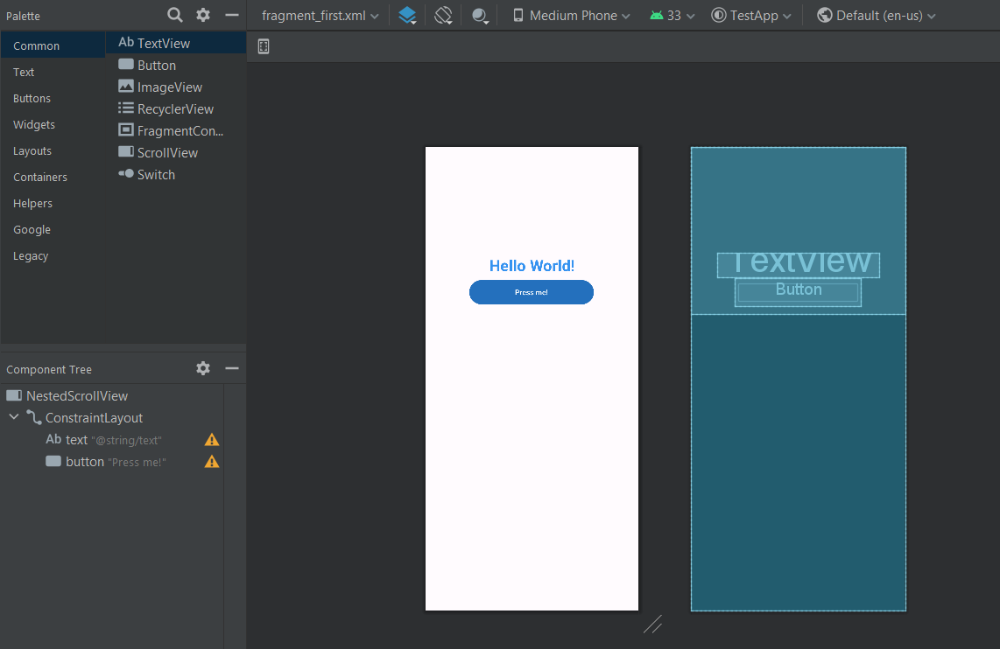

# Entry 1
##### 11/6/23

I decided to make an Android reminder app, and my tool is Android Studio. I tinkered with it by making a test app where when you press a button, the text "Hello World!" turns to "Goodbye World!".

To do this, I used the UI editor to add text and a button to the screen. It automatically generated some code in the xml file, and I used the [TextView docs from Android Developers](https://developer.android.com/reference/android/widget/TextView) to change the text and color using the xml attributes `gravity`, `textColor`, `textSize` and `textStyle`.
```java
android:gravity="center"
android:text="@string/text" // Hello World!
android:textColor="#3592f0"
android:textSize="30sp"
android:textStyle="bold"
```
I also set the string `text` to "Hello World!".
```java
<string name="text">
    Hello World!
</string>
```

This is an image of the UI editor.


To change the text when I press the button, I have a function [(which I partially got from this Stack Overflow post)](https://stackoverflow.com/questions/4768969/how-do-i-change-textview-value-inside-java-code) that uses the `setText` method to change the text:
```java
binding.button.setOnClickListener(new View.OnClickListener() {
    @Override
    public void onClick(View view) {
        final TextView theText = (TextView) getActivity().findViewById(R.id.text);
        theText.setText("Goodbye World!");
    }
});
```

Here's it in action on my phone:  


I am on step 1 of the Engineering Design Process: defining the problem/project, which is the reminder app I'm going to be making.

A few skills I grew in are how to learn and how to google. I learned how to use a new IDE to make a test app and searched for how I could change the text using Java in Android Studio.


[Next](entry02.md)

[Home](../README.md)