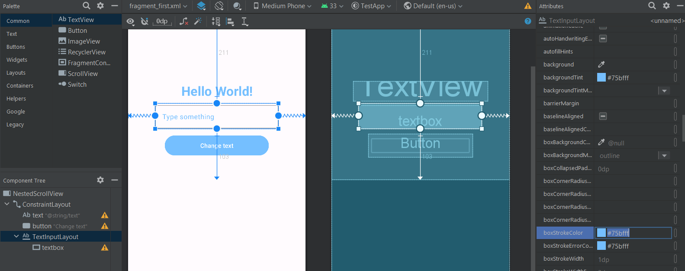
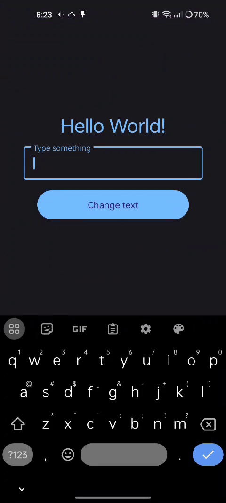

# Tool Learning Log

Tool: **Android Studio (Java)**

Project: **A reminder app where you pin the reminder/task to your notifications, either immediately or timed**

---

10/27/23 - 10/28/2023:
* What I did:
    * Created a new project using the `Basic Views Activity` template
    * Using the template, made it so when you press a button the text changes from "Hello World!" to "Goodbye World!"

* Links used:
    * Android Studio [TextView](https://developer.android.com/reference/android/widget/TextView)
    * Specific attributes:
        * Customizing text: `textSize`, `textColor`, `textStyle`, `gravity` (alignment)
        * Customizing button: `backgroundTint`
        * Changing text value: `setText`
    * [Stack Overflow post](https://stackoverflow.com/questions/4768969/how-do-i-change-textview-value-inside-java-code) for changing the text

* Code
    * Changing text
        ```java
          // activity_main.xml
          binding.button.setOnClickListener(new View.OnClickListener() {
              @Override
              public void onClick(View view) {
                final TextView theText = (TextView) getActivity().findViewById(R.id.text);
                theText.setText("Goodbye World!");
              }
          });
          ```
    * Customizing text & button
        ```java
        // strings.xml
        <string name="text">
            Hello World!
        </string>
        ```
        ```xml
        <!-- fragment_first.xml -->
        <TextView
            android:id="@+id/text"
            android:layout_width="311dp"
            android:layout_height="46dp"
            android:layout_marginTop="188dp"
            android:gravity="center"
            android:text="@string/text"
            android:textColor="#3592f0"
            android:textSize="30sp"
            android:textStyle="bold"
            app:layout_constraintEnd_toEndOf="parent"
            app:layout_constraintHorizontal_bias="0.504"
            app:layout_constraintStart_toStartOf="parent"
            app:layout_constraintTop_toTopOf="parent" />

        <Button
            android:id="@+id/button"
            android:layout_width="241dp"
            android:layout_height="54dp"
            android:layout_marginTop="236dp"
            android:backgroundTint="#2470bd"
            android:text="Press me!"
            app:layout_constraintEnd_toEndOf="parent"
            app:layout_constraintHorizontal_bias="0.497"
            app:layout_constraintStart_toStartOf="parent"
            app:layout_constraintTop_toTopOf="parent" />
        ```

---

12/26/23(?) & 1/7/24
- What I did:
    - Added a textbox using the UI editor & edited attributes to make most of the color a light blue (#75bfff)
    - Got the text entered and set "Hello World!" to that text
        - Used [How to get the text from the textbox post](https://stackoverflow.com/questions/3606646/how-to-retrieve-text-from-textbox-in-android-widget) on Stack Overflow

- Code:
    - Imported EditText widget at the top of FirstFragment.java: `import android.widget.EditText;`
    - Changed the button's text from "Press me!" to "Change text": `android:text="Change text"` (fragment_first.xml)
    - Changed textbox color to mostly #75bfff (auto-generated from UI editor)
        ```xml
        <!-- fragment_first.xml -->
        <com.google.android.material.textfield.TextInputLayout
            android:layout_width="285dp"
            android:layout_height="59dp"
            android:layout_marginTop="211dp"
            android:layout_marginBottom="103dp"
            android:backgroundTint="#75bfff"
            android:textColorHint="#75bfff"
            app:boxStrokeColor="#75bfff"
            app:boxStrokeErrorColor="#75bfff"
            app:cursorColor="#75bfff"
            app:endIconTint="#75bfff"
            app:helperTextTextColor="#75bfff"
            app:hintTextColor="#75bfff"
            app:layout_constraintBottom_toBottomOf="parent"
            app:layout_constraintEnd_toEndOf="parent"
            app:layout_constraintHorizontal_bias="0.5"
            app:layout_constraintStart_toStartOf="parent"
            app:layout_constraintTop_toTopOf="parent"
            app:placeholderTextColor="#75bfff"
            app:prefixTextColor="#75bfff"
            app:startIconTint="#75bfff"
            app:suffixTextColor="#75bfff">
        ```
    - Added onto code from last time and changed `text` to the text in the textbox
        ```java
        // FragmentFirst.java
        binding.button.setOnClickListener(new View.OnClickListener() {
            @Override
            public void onClick(View view) {
                final TextView theText = (TextView) getActivity().findViewById(R.id.text);

                EditText editText = (EditText) getActivity().findViewById(R.id.textbox);
                String newText = editText.getText().toString();

                theText.setText(newText);
            }
        });
        ```
- Image + Video
    
    

<!--
* Links you used today (websites, videos, etc)
* Things you tried, progress you made, etc
* Challenges, a-ha moments, etc
* Questions you still have
* What you're going to try next
-->
